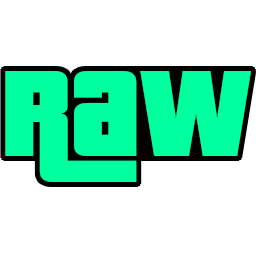

# rawberth Static

These are some images created for a myriad of purposes.

## Created by rawberth
For various server profiles 
     
 
    
 
For seasonal server profiles 
    
 
Created for Discord servers 
 

## Remade or otherwise altered
     
 
     

## Shamelessly stolen
    

## Created by others for me
 Created by the great kaotikb
 
 Created by the great hugoni
